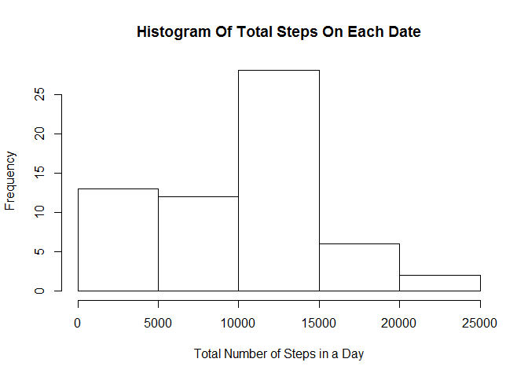
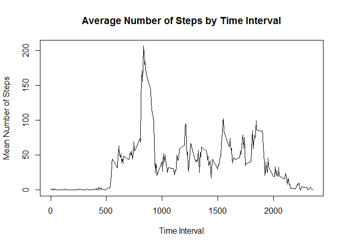
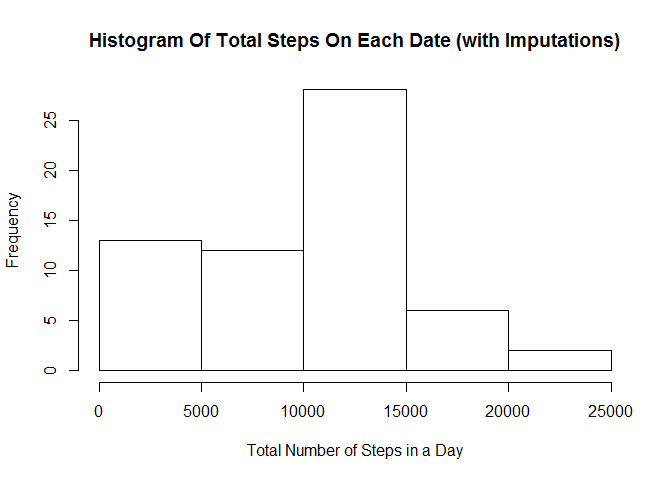
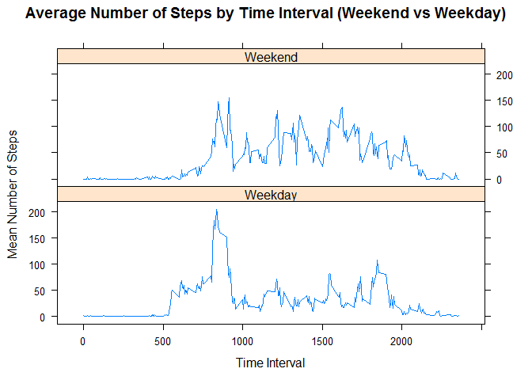

## Loading and preprocessing the data

First we must read in the activity data, printing the structure of the data set to get a feel for the variables we will use:

```r
activity_data <- read.csv('activity_data.csv')
str(activity_data)
```

```
## 'data.frame':	17568 obs. of  3 variables:
##  $ steps   : int  NA NA NA NA NA NA NA NA NA NA ...
##  $ date    : Factor w/ 61 levels "2012-10-01","2012-10-02",..: 1 1 1 1 1 1 1 1 1 1 ...
##  $ interval: int  0 5 10 15 20 25 30 35 40 45 ...
```

Currently the date variable is in a factor format, so it would be useful to convert it into a date-time format. This is performed using the lubridate package as follows:


```r
activity_data$date <- ymd(activity_data$date)
```

The dataset contains three variables. Namely steps, date and interval. The **steps** variable represents the number of steps taken in a given 5 minute time interval on a given date. This interval and date are detailed in the **interval** and **date** variables respectively.

## What is the mean total number of steps taken per day?

We may wish to look at a number of statistics regarding the total number of steps per day. To do this we group the data set by date and sum the steps variable (removing **NA** values), first converting to a tibble so we can use the dplyr package:


```r
activity_data_by_day <- activity_data %>%
  as_tibble %>%
  group_by(date) %>%
  summarize(total_steps=(sum(steps,na.rm=TRUE)))
```

Let's look at a histogram of the number of steps per day:


```r
with(activity_data_by_day,hist(total_steps,
                               main="Histogram Of Total Steps On Each Date",
                               xlab="Total Number of Steps in a Day"))
```

<!-- -->

The mean and median values can be obtained using the following code:


```r
summary(activity_data_by_day$total_steps)
```

```
##    Min. 1st Qu.  Median    Mean 3rd Qu.    Max. 
##       0    6778   10395    9354   12811   21194
```

## What is the average daily activity pattern?

Now let's look at a time series plot of the average number of steps (y-axis) across all the different specified intervals (x-axis). First we must summarize the activity data by interval:


```r
activity_data_by_interval <- activity_data %>%
  as_tibble %>%
  group_by(interval) %>%
  summarize(average_steps=mean(steps,na.rm=TRUE))
```
 
Now plot:


```r
with(activity_data_by_interval,plot(interval,
                                    average_steps,
                                    type="l",
                                    main="Average Number of Steps by Time Interval",
                                    xlab="Time Interval",
                                    ylab="Mean Number of Steps"))
```

<!-- -->

The time interval at which the maximum occurs can be found using the code:


```r
max_index <- with(activity_data_by_interval,which(average_steps==max(average_steps)))
activity_data_by_interval$interval[max_index]
```

```
## [1] 835
```

## Imputing missing values

Let's revert back to the original data set, **activity_data**. The data set has a total of


```r
sum(!complete.cases(activity_data))
```

```
## [1] 2304
```

rows with at least one NA value. These NA values occur entirely in the steps column. We wish to impute values instead of the NA values. For this we will take the median value for the interval in which the NA occurs. Let's create a dataset with the median for each interval (without the NAs)


```r
activity_data_median_impute <- activity_data %>%
  as_tibble %>%
  group_by(interval) %>%
  summarize(median_steps=median(steps,na.rm=TRUE))
```

We impute over the NAs by defining a function which takes the NA entry and maps to the appropriate interval median.


```r
impute <- function(x,intvl){
  if(is.na(x)){
    return(activity_data_median_impute$median_steps[activity_data_median_impute$interval==intvl])
  }
  else{
    return(x)
  }
}
#mapply impute function to the entire steps column - then add to a new col of activity_data
activity_data$steps_impute <- mapply(impute,activity_data$steps,activity_data$interval)
```

Now let's look at a histogram of the total number of steps taken each day again, but this time with the imputed values. To do this we must create a summed dataset, grouped by day.


```r
activity_data_by_day_impute <- activity_data %>%
  as_tibble %>%
  group_by(date) %>%
  summarize(total_steps_impute=sum(steps_impute))
```

Then we create the histogram.


```r
with(activity_data_by_day_impute,hist(total_steps_impute,
                               main="Histogram Of Total Steps On Each Date (with Imputations)",
                               xlab="Total Number of Steps in a Day"))
```

<!-- -->

The new mean and median values can be obtained using the following code:


```r
summary(activity_data_by_day_impute$total_steps_impute)
```

```
##    Min. 1st Qu.  Median    Mean 3rd Qu.    Max. 
##      41    6778   10395    9504   12811   21194
```

The new median does not differ from the estimate with the NAs removed, however the mean has increased from 9354 to 9504.

## Are there differences in activity patterns between weekdays and the weekends?

We now wish to differentiate between activity patterns on weekdays and weekends. We must first add a new column to our data set which outlines whether a particular row is a weekday or a weekend. We make use of the weekdays function as follows:


```r
weekday_vector <- weekdays(activity_data$date)

#sapply to every element of weekday_vector to decide whether it's a weekday or weekend
weekend_weekday <- sapply(weekday_vector,
                          function(x){ifelse(x %in% c('Monday','Tuesday','Wednesday','Thursday','Friday'),"Weekday","Weekend")})

# add to activity_data df as a factor
activity_data$day_type <- factor(weekend_weekday)
```

Now let's create a time series plot similar to the last one, but split into data from weekends vs weekdays. First we must group by day_type and interval and calculate the mean number of steps.


```r
activity_data_by_interval_impute <- activity_data %>%
  as_tibble %>%
  group_by(day_type,interval) %>%
  summarize(average_steps_impute=mean(steps_impute))
```
 
Now plot:


```r
xyplot(average_steps_impute ~ interval | day_type,
       data=activity_data_by_interval_impute,
       type="l",
       layout=c(1,2),
       main="Average Number of Steps by Time Interval (Weekend vs Weekday)",
       xlab="Time Interval",ylab="Mean Number of Steps")
```

<!-- -->

Mean steps have a higher early peak in the Weekdays data, but at intervals >1000 the mean number of steps are generally lower than on the weekends.
